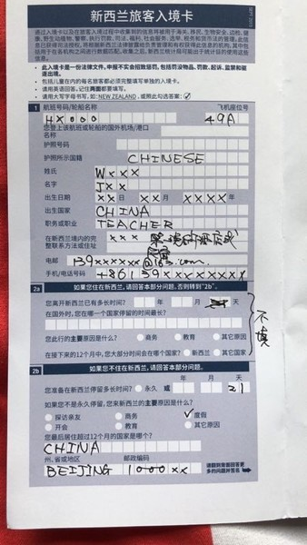
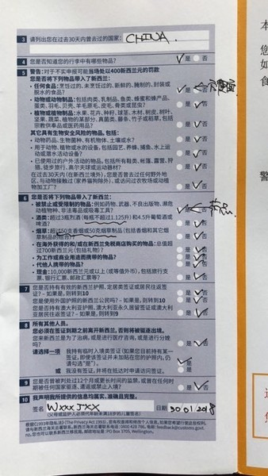
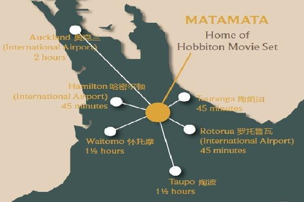

蜜月旅行，新西兰自驾，我们来啦！

<!--more-->

<h2>Table of Contents</h2>

<ul>
<li><a href="#orgc935712">1. 新西兰</a>
<ul>
<li><a href="#orgc43ab30">1.1. 行前准备</a>
<ul>
<li><a href="#org59b0d8e">1.1.1. 必备</a></li>
<li><a href="#org370e756">1.1.2. 装备</a></li>
<li><a href="#orge7ca694">1.1.3. 待办事项</a></li>
</ul>
</li>
<li><a href="#orgd5d73f7">1.2. 注意事项</a>
<ul>
<li><a href="#org982256a">1.2.1. 消费</a></li>
<li><a href="#orgbba292d">1.2.2. 无人机航拍</a></li>
<li><a href="#org8e25d03">1.2.3. 入境卡</a></li>
<li><a href="#orgc5cee4d">1.2.4. 租车</a></li>
<li><a href="#org0541168">1.2.5. 自驾</a></li>
</ul>
</li>
<li><a href="#org6d633f8">1.3. 景点</a>
<ul>
<li><a href="#orgada14d1">1.3.1. 北岛（2～3天）</a></li>
<li><a href="#orge8b5065">1.3.2. 南岛</a></li>
</ul>
</li>
<li><a href="#org71da9ab">1.4. 行程</a>
<ul>
<li><a href="#orgc5b79af">1.4.1. 2018/3/18</a></li>
<li><a href="#org2fa8ab9">1.4.2. 2018/3/19</a></li>
<li><a href="#org53378cb">1.4.3. 2018/3/20</a></li>
<li><a href="#orgc7160fa">1.4.4. 2018/3/21</a></li>
<li><a href="#org1d7e64c">1.4.5. 2018/3/22</a></li>
<li><a href="#orge859aac">1.4.6. 2018/3/23</a></li>
<li><a href="#org74ded9a">1.4.7. 2018/3/24</a></li>
<li><a href="#orge10038a">1.4.8. 2018/3/25</a></li>
<li><a href="#orgcc7739b">1.4.9. 2018/3/26</a></li>
<li><a href="#org18be215">1.4.10. 2018/3/27</a></li>
<li><a href="#org398faaf">1.4.11. 2018/3/28</a></li>
<li><a href="#orgcbd5369">1.4.12. 2018/3/29</a></li>
<li><a href="#orgcf32482">1.4.13. 2018/3/30</a></li>
</ul>
</li>
</ul>
</li>
</ul>

# 新西兰

## 行前准备

### 必备

-   [ ] 护照
-   [ ] 驾驶证及翻译件
-   [ ] 现金
-   [ ] 身份证
-   [ ] 大使馆联系方式
-   [ ] 地图，IPAD下载好Google离线地图
-   [ ] 平安境外旅游保险

### 装备

-   [ ] 手机卡
-   [ ] wifi
-   [ ] 自拍杆
-   [ ] 相机
-   [ ] 租用广角相机镜头
-   [ ] 租用无人机
-   [ ] 插线板，国内通用的三孔插头
-   [ ] 墨镜、帽子
-   [ ] 防晒
-   [ ] 冲锋衣、登山鞋

### 待办事项

-   驾照翻译
    -   **支付宝可免费翻译**
-   [ ] 租车
-   [ ] 新西兰国内机票
-   [ ] 酒店
-   [ ] 交规学习

## 注意事项

### 消费

-   [ ] 超市
    -   建议去华人超市：三商超市

### 无人机航拍

-   新西兰有法规规定无人机的使用
-   机场附近除非有申请允许否则一律禁止飞行
-   规定晚上不能飞
-   规定要在视距内飞行
-   经过私人土地时要经过所有人同意（如果想在牧场拍羊的话要经过牧场主的同意）
-   有些景点有标示禁止飞行（马瑟森湖、好牧羊人教堂）
-   在市区内飞行需要经过同意
-   其它相关规定可以在网上查询

### 入境卡

-   
-   

### 租车

-   注意车况

### 自驾

-   逢加油站必加油，说不定油就不够到下一个加油站的
-   查询路况 <http://www.journeys.nzta.govt.nz/traffic/>

## 景点

### 北岛（2～3天）

-   [ ] 奥克兰
    -   天空眼
    -   伊山
-   [ ] **怀托摩萤火虫洞** 
    -   建议定11点的，不用起太早，飞猪可定
-   [ ] **霍比特人小镇**
    -   建议定15：05的
-   [ ] 罗托鲁阿
-   [ ] 地热公园(Wai-O-Tapu)
    -   色彩丰富，全球最超现实的二十个地方之一
    -   **限飞，不要带无人机**
    -   诺克斯夫人喷泉 每天上午10：15喷发
-   [ ] 火山谷 (Waimangu)
-   [ ] 蒂普亚地热村(Te Puia)(毛利文化村)
-   [ ] 地狱之门(泥浆浴)
-   [ ] 红树林(The Redwoods)
-   [ ] 政府花园(Government Gardens)

### 南岛

-   [ ] 特卡波(Tecapo)
    -   湖(Lake Tecapo)
    -   星空 好牧人教堂
        **日照时间很长，观星时间估计在晚11点～早3点之间**
-   鲁冰花 *不一定有了，因为已经夏末了*
    -   网红石板牛排, **需要预订**
-   [ ] 阿卡罗阿
    -   牧场，羊驼, **需要预订**
-   [ ] 基督城
    -   中心花园
    -   植物园
-   [ ] 普卡基湖
    -   网红高山三文鱼
-   [ ] 库克山冰川
-   [ ] 福克斯冰川
-   [ ] 瓦纳卡
    -   跳伞
-   [ ] 箭镇
-   [ ] 皇后镇
-   [ ] 瓦卡蒂普湖
    -   蒸汽船

## 行程

### 2018/3/18

-   [ ] 上海浦东机场(2018/3/18 16:45)
-   [ ] (2018/3/18 19:45)香港国际机场(2018/3/18 22:55)

### 2018/3/19

-   [ ] (2018/3/19 15:30)奥克兰国际机场
-   [ ] 拿车
-   [ ] 驾车前往奥克兰市中心，吃晚饭
-   [ ] 可以去天空塔
-   [ ] 回住处
    -   Leo & Jillian Wang
    -   手机： +64 27 353 6001
    -   电子邮箱： leojillian-mtjtzx5do49e28uy@host.airbnb.com
    -   确认码：HMBS5D842M
    -   地址: 89A Namata Rd, One Tree Hill, Auckland 1061, New Zealand
    -   \*晚上1

### 2018/3/20

-   [ ] 怀托摩洞（Waitomo Caves) P126
    -   建议只参观萤火虫洞，其它两个洞都是生态岩洞
    -   电话 +64-7-8788228
    -   网址 <http://www.waitomo.com/>
    -   交通 沿着3号国家高速公路转向Waitomo Caves Road，再行8公里。距离奥克兰2小时车程，距离汉密尔顿1小时车程，距离罗托鲁瓦2小时车程。自驾或乘坐出发地的大巴前往。
    -   门票 根据你的时间和兴趣，自由组合3个怀托摩独特的洞穴中的两个或三个。最流行的combo组合: 怀托摩萤火虫洞 Waitomo Glowworm Caves和Ruakuri洞。如你有更多的时间探索新西兰最好的3个地下洞穴, 三洞的组合Triple Cave Combo是绝好的选择。
        -   萤火虫洞：成人49新元，4-14岁儿童21.5新元，家庭票118新元；4岁以下儿童免费。
        -   双洞游（增加阿拉奴伊洞），增加费用成人22新元，儿童9.5新元，家庭35新元；
        -   三洞游（增加阿拉奴伊洞和鲁阿库利洞），增加费用成人44新元，儿童19.5新元，家庭85新元。
    -   开放时间
        -   11月1日-3月31日下午17:30最后发团；4月1日-10月31日每天9:00-17:00逢半点发团；
        -   圣诞节12月25日下午16:00最后发团。
        -   12月26日和1月31日，下午18:00和19:00增发两团。
    -   景点位置 39 Waitomo Caves Road, RD 7, Waitomo Caves, Otorohanga 3977新西兰
-   [ ] Hamilton植物园
-   [ ] 霍比特人小镇（Hobbiton, Matamata）
    -   参观时长：2小时
    -   集合地点：The Shires Rest,501 Buckland Rd，Hinuera,Matamata （夏尔餐厅就在霍比特人村里，仅需2分钟路程就能到达）
    -   可选游览时间点：
        -   上午8:05分（2018年1月1日至1月31日期间开放）
        -   上午8:45分（2018年2月1日至2月28日期间开放）
        -   上午10:40分（开放至2018年4月30日）
        -   下午12:25分（全年开放，除圣诞节）
        -   下午15:05分（全年开放，除圣诞节）
        -   下午17:25分（2017年12月26日至2018年2月28日期间开放）
    -   从夏尔餐厅或Matamata I-Site游客中心换票后集合，导游带领乘坐景区观光巴士
    -   从各地出发到此所需时间见下图

-   [ ] 罗托鲁阿（Rotorua）

### 2018/3/21

-   [ ] 罗托鲁阿
-   [ ] 地热公园（Wai-O-Tapu）
    -   电话 +64-7-366633-
    -   网址 <http://waiotapu.co.nz/>
    -   用时参考 0.5～1小时
    -   交通 从罗托鲁瓦向南出发沿SH5陶波方向自驾需40分钟
-   门票 32.5NZD
    -   开发时间 8：30～17：00
    -   景点位置 201 Waiotapu Loop Road, RD 3, Rotorua 3073, New Zealand
-   [ ] 奥克兰
-   [ ] 飞往基督城

### 2018/3/22

-   [ ] 阿卡罗阿牧场
    -   看草泥马
-   [ ] 回基督城

### 2018/3/23

-   [ ] 特卡波
-   [ ] 好牧人教堂观星空
-   酒店：特卡波湖度假屋别墅（Book Tekapo Holiday Home） 携程（17351523553）
    -   地址：4 Simpson Lane, 杜布森山滑雪场，特卡波湖，坎特伯雷大区，7999，新西兰
    -   电话：13817299137
    -   订单号：5689390679
    -   酒店确认码:4760
    -   预订日期：2018-03-06
    -   房型：豪华湖景一卧别墅

### 2018/3/24

-   [ ] 出发前往库克山
    -   沿途有三四十公里的沿湖公路，普卡基湖
    -   **多带零食和小吃，库克山餐厅有点贵**
-   [ ] 库克山徒步

### 2018/3/25

-   [ ] 瓦纳卡跳伞

### 2018/3/26

-   [ ] 箭镇
-   [ ] 皇后镇
-   [ ] 瓦卡蒂普湖蒸汽船

### 2018/3/27

-   [ ] 皇后镇
    -   [ ] Skyline天空缆车 + 山顶海鲜自助晚餐 399RMB/人
    -   [ ] 天际雪橇

### 2018/3/28

-   [ ] 达尼丁

### 2018/3/29

-   [ ] 回基督城
-   [ ] 飞回奥克兰
-   [ ] 伊甸山
-   [ ] 天空塔
    -   门票：28NZD
    -   空中漫步价格： 688RMB
    -   蹦极价格：988RMB
-   [ ] 博物馆

### 2018/3/30

-   [ ] 奥克兰国际机场(2018/3/30 00:30)
-   [ ] (2018/3/30 08:05)香港国际机场(2018/3/30 21:00)
-   [ ] (2018/3/30 23:40)上海浦东机场

